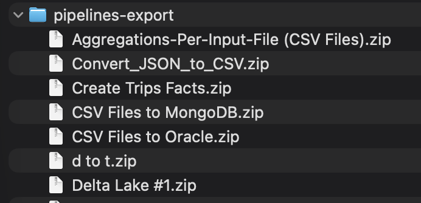
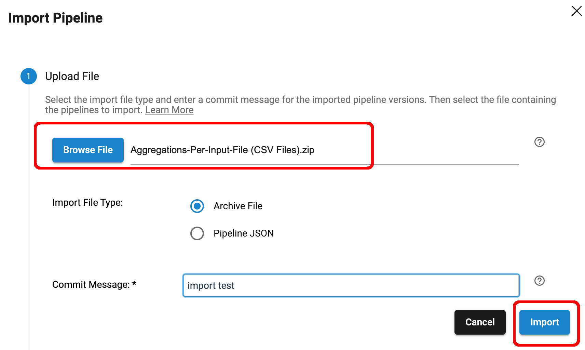
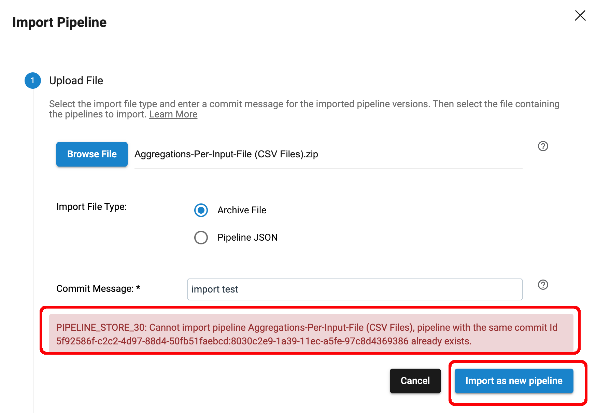
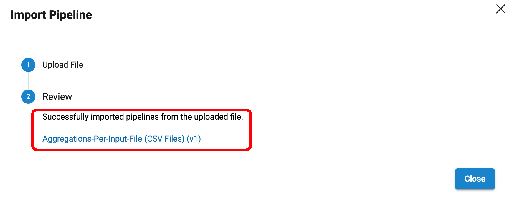

# streamsets-old-pipelines-cleanup

This project provides three utility scripts that use the [IBM StreamSets SDK for Python](https://support-streamsets-com.s3.us-west-2.amazonaws.com/streamsets-docs/platform-sdk/latest/index.html) to clean up old pipelines from [IBM StreamSets](https://www.ibm.com/products/streamsets).  Pipelines are considered old if no version of the pipeline is associated with a Job and the last modification to the pipeline was before a user-specified "last modified date threshold".  This project is a companion to [this project](https://github.com/onefoursix/streamsets-old-jobs-cleanup) that deletes old Jobs

The scripts perform the following actions and are intended to be run in the following order to minimize risk when deleting pipelines:

- Script #1 [get-old-pipelines.py](python/get-old-pipelines.py): This script writes a list of pipelines that meet two criteria:  no version of the pipeline is associated with a Job and the last modification to the pipeline was before a user-specified "last modified date threshold".  

- Script #2 [export-old-pipelines.py](python/export-old-pipelines.py): This script exports the most current non-DRAFT version of each pipeline in the list created by script #1. The exports serve as backups in case any pipelines deleted by script #3 need to be restored.  Please carefully read the "Important Notes" in the details below regarding the handling of pipeline DRAFT versions.  **TL;DR -- Publish any DRAFT versions you want to export!**

- Script #3 [delete-old-pipelines.py](python/delete-old-pipelines.py): This script deletes the pipelines in the list created by script #1. The script will write a list of pipelines that were successfully deleted and those that were not. The API credentials used to run this script must have at least read/write permissions on the pipelines in order to delete them. 

***
Note that all three of these scripts could relatively easily be clubbed together into a single script, and one could add a "dry run" feature, but I chose to use three separate scripts so the critical "delete pipeline" logic (in script #3) could more easily be inspected for correctness.  Additionally, this approach allows the user to edit the list of old pipelines created by the first script to control which pipelines will be deleted by the third script.

And once again, please carefully read the "Important Notes" in the details below regarding the handling of pipeline DRAFT versions.  

***

See the details for running each script below.

## Prerequisites

- Python 3.9+

- StreamSets Platform SDK for Python v6.6+. Docs are [here](https://docs.streamsets.com/platform-sdk/latest/welcome/installation.html)

 - StreamSets Platform API Credentials for a user with at least read/write permissions for the pipelines to be deleted.

 - Before running any of the scripts, export the environment variables <code>CRED_ID</code> and <code>CRED_TOKEN</code>
  with StreamSets Platform API Credentials, like this:
```
    	$ export CRED_ID="40af8..."
    	$ export CRED_TOKEN="eyJ0..."
```

## Script #1 - get-old-pipelines.py

Description:   This script writes a list of old pipelines.   Pipelines are considered old if no version of the pipeline is associated with a Job and the last modification to the pipeline was before a user-specified "last modified date threshold". 

#### Args:

- <code>last_modification_date_threshold</code> - A String in the form yyyy-mm-dd that is the threshold date to mark pipelines as needing to be cleaned up if they have not been modified since before that date, and if no version of the pipeline is associated with a Job.

- <code>output_file</code> - The full path to a file where the list of old pipelines will be written. Directories in the path will be created as needed, and if an existing file of the same name exists, it will be overwritten.


#### Usage:          
<code>$ python3 get-old-pipelines.py <last_modification_date_threshold> <output_file></code>

#### Usage Example:   
<code>$ python3 get-old-pipelines.py 2023-10-12 /Users/mark/old-pipelines/old_pipelines.json</code>

#### Example Run:
```
$ python3get-old-pipelines.py 2023-10-12 /Users/mark/old-pipelines/old_pipelines.json 

---------------------------------
Searching for old pipelines not associated with Jobs
Last Modification Date Threshold: '2023-10-12'
Output file: '/Users/mark/old-pipelines/old_pipelines.json'
---------------------------------
Connecting to Control Hub
---------------------------------
Getting Job/Pipeline associations
---------------------------------
Searching for old pipelines not associated with Jobs.
Please be patient; this may take a while...
...
---------------------------------
Found 190 old pipelines not associated with any Jobs.
Writing the list of old pipelines to the output file.
---------------------------------
Done


```
Here is a snippet of the data written to the output file <code>old_pipelines.json</code> including the pipeline name, id, last modified timestamp, version number and if the pipeline is a Draft version or not. Note that the pipelines are sorted in alphabetical order by name:

```
{"pipeline_name": "Convert_JSON_to_CSV", "pipeline_id": "a8e68710-5bec-4e69-aad3-8d11553d52ca:8030c2e9-1a39-11ec-a5fe-97c8d4369386", "last_modified": "2023-10-07 21:15:14", "version": "6", "is_draft": false}
{"pipeline_name": "Create Data for Use Case 3", "pipeline_id": "72a2be2d-fb81-48a7-846a-1d1e25bec4ca:8030c2e9-1a39-11ec-a5fe-97c8d4369386", "last_modified": "2023-10-06 15:53:01", "version": "1-DRAFT", "is_draft": true}
{"pipeline_name": "Create Trips Facts", "pipeline_id": "a86adf84-cd6f-4aa2-949e-cc2cdf5895f0:8030c2e9-1a39-11ec-a5fe-97c8d4369386", "last_modified": "2023-09-27 13:07:03", "version": "18.5-DRAFT", "is_draft": true}


```

## Script #2 - export-old-pipelines.py

Description:   This script exports the latest non-Draft version of each pipeline listed in the input file. The exports serve as backups in case any pipelines deleted by script #3 need to be restored. 

<hr/>

### Important Note #1:

In order to avoid the chance of exporting any plain-text credentials, this script sets <code>include_plain_text_credentials</code> to <code>False</code> in the <code>sch.export_pipelines</code> command. 

***This has the side effect of not allowing Draft versions of pipelines to be exported.***
Please contact me at <code>mark.brooks@ibm.com</code> if you want to change this behavior.  

The current version of this script will handle Draft versions of pipelines in the following manner:

- If the latest modified version of a pipeline is <code>V1-DRAFT</code>, the pipeline will not be exported as there are no published versions!

- If the latest modified version of a pipeline is a <code>DRAFT</code> version higher than <code>V1</code> (i.e at least one version of the pipeline was published), the pipeline will export the version with the most recent "last modified" timestamp, which may not necessarily be the highest version number. For example, if v3.3 was published more recently than v5, v3.3 will be exported.

See the Example Run's output messages below for examples of handling these scenarios.

<hr/>

### Important Note #2:

The script only exports the latest published version of any pipeline (assuming at least one version was published).

This script could be modified to export every version of every pipeline but that struck me as excessive.  Once again, let me know if you want to change the default behavior of this script.
<hr/>

### Important Note #3:

This script sets <code>include_plain_text_credentials</code> to <code>False</code> in the <code>sch.export_pipelines</code> command, which means that if you have hard-coded credentials within your pipelines, they will not be exported! 

<hr/>


#### Args:

- <code>input_file</code> - A JSON list of pipelines to export (i.e. the output file written by script #1)

- <code>export_dir</code> - The directory to write the exported pipelines to. The directory will be created if it does not exist. If the directory does exist, it must be empty

#### Usage:          
<code>$ python3 export-old-pipelines.py <input_file> <export_dir></code> 

#### Usage Example:  
<code>$ python3 export-old-pipelines.py /Users/mark/old-pipelines/old_pipelines.json /Users/mark/pipelines-export</code>

This script does not write a log, so if you want to capture the results of this script in a file, redirect its output like this:

<code>$ python3 export-old-pipelines.py /Users/mark/old-pipelines/old_pipelines.json /Users/mark/pipelines-export > /Users/mark/pipelines-export.log</code> 

#### Example Run
Here are snippets of an example run of successful exports for  pipelines that did not have any <code>DRAFT</code> versions:

```
$ python3 export-old-pipelines.py /Users/mark/old-pipelines/old_pipelines.json /Users/mark/pipelines-export 
---------------------------------
input_file: '/Users/mark/old-pipelines/old_pipelines.json'
---------------------------------
export_dir: '/Users/mark/pipelines-export'
---------------------------------
Connecting to Control Hub
---------------------------------
Exporting Pipelines...
---------------------------------
Exporting pipeline 'Excel ETL' version '1' with pipeline ID '39b27983-c1c5-4750-8625-4ce6bdeb5157:8030c2e9-1a39-11ec-a5fe-97c8d4369386'into the file '/Users/mark/pipelines-export/Excel ETL.zip'
---------------------------------
Exporting pipeline 'Excel to Snowflake' version '1' with pipeline ID 'a57161b9-916e-410f-9e8f-e6dc400907ea:8030c2e9-1a39-11ec-a5fe-97c8d4369386'into the file '/Users/mark/pipelines-export/Excel to Snowflake.zip'
---------------------------------
```
Here is an example of a pipeline with only a <code>V1-DRAFT</code> version generating a WARNING that it was not exported!

```
---------------------------------
Exporting pipeline 'Files to Snowflake' version '5' with pipeline ID '64d52992-6d78-4ac4-8591-b71ed4d4f769:8030c2e9-1a39-11ec-a5fe-97c8d4369386'into the file '/Users/mark/pipelines-export/Files to Snowflake.zip'
Pipeline '146-databricks-on-azure' version '1-DRAFT' with pipeline ID '17008a20-444d-45c8-a8bc-5e7f55a8dade:8030c2e9-1a39-11ec-a5fe-97c8d4369386' is a draft pipeline and can't be exported.
Looking for the most recent published version of the pipeline...
No published versions found for this pipeline
Warning: Pipeline '146-databricks-on-azure' with pipeline ID '17008a20-444d-45c8-a8bc-5e7f55a8dade:8030c2e9-1a39-11ec-a5fe-97c8d4369386' was not exported!
---------------------------------

```

And here is an example of a pipeline with a <code>V5-DRAFT</code> version generating a message that V4 was exported:


```
---------------------------------
Pipeline 'Aggregations-Per-Input-File (CSV Files)' version '5-DRAFT' with pipeline ID '37d43171-334a-4991-8609-bf538c783c8e:8030c2e9-1a39-11ec-a5fe-97c8d4369386' is a draft pipeline and can't be exported.
Looking for the most recent published version of the pipeline...
Found version '4' of the pipeline
Exporting pipeline 'Aggregations-Per-Input-File (CSV Files)' version '4' with pipeline ID '37d43171-334a-4991-8609-bf538c783c8e:8030c2e9-1a39-11ec-a5fe-97c8d4369386'into the file '/Users/mark/pipelines-export/Aggregations-Per-Input-File (CSV Files).zip'
---------------------------------
```

#### Example Export Files
Here is my pipelines-export dir after running the script:




A good test to perform at this point is to manually import one or more of the exported pipelines to confirm the exported pipelines are valid, like this. Note the middle screenshot that shows how you can import a pipeline even if a pipeline with the same ID already exists:








## Script #3 - delete-old-pipelines.py

#### Description:   
This script attempts to delete pipelines from the pipeline IDs in the input file.  

### Important Note:

Be careful! This script attempts to delete all versions of all pipelines listed in the input file!  This includes pipelines that have only a <code>v1-DRAFT</code> version, and regardless of whether Script #2 exported an archive for the pipeline or not! It is strongly recommended that you test this script on a small input file -- perhaps only 2 or 3 lines -- to confirm it is working correctly in your environment.  Make sure you understand the logic of Script #2's handling of <code>DRAFT</code> versions.

<hr/>


#### Args:
- <code>input_file</code> - A JSON list of pipelines to delete.

#### Usage:          
<code>$ python3 delete-old-pipelines.py <input_file></code>

#### Usage Example:  

<code>$ python3 delete-old-pipelines.py /Users/mark/old-pipelines/old_pipelines.json</code>

This script does not write a log, so if you want to capture the results of this script in a file, redirect its output like this:

<code>$ python3 delete-old-pipelines.py /Users/mark/old-pipelines/old_pipelines.json > /Users/mark/deleted-pipelines.log</code>

A good test to perform at this point is to manually edit an <code>old_pipelines.json</code> input file so there are only a couple of pipelines listed, run the script, and confirm those pipelines are correctly deleted.


#### Example Run:
```
$ python3 ./delete-old-pipelines.py /Users/mark/old-pipelines/old_pipelines.json 
---------------------------------
input_file: '/Users/mark/old-pipelines/old_pipelines.json'
---------------------------------
Connecting to Control Hub
---------------------------------
Preparing to delete pipeline 'AKS Test' with ID '226b2e42-512f-48f7-82de-f5eed8032d53:8030c2e9-1a39-11ec-a5fe-97c8d4369386'
- Found Pipeline
- Pipeline was deleted.
---------------------------------
Preparing to delete pipeline 'Aggregations-Per-Input-File (CSV Files)' with ID '37d43171-334a-4991-8609-bf538c783c8e:8030c2e9-1a39-11ec-a5fe-97c8d4369386'
- Found Pipeline
- Pipeline was deleted.
---------------------------------
Preparing to delete pipeline 'BQ Truncate and Load Orchestration' with ID '831bc09a-d9bd-4b22-adca-a8bc1d69fb80:8030c2e9-1a39-11ec-a5fe-97c8d4369386'
- Found Pipeline
- Pipeline was deleted.
---------------------------------
...

Done
```


